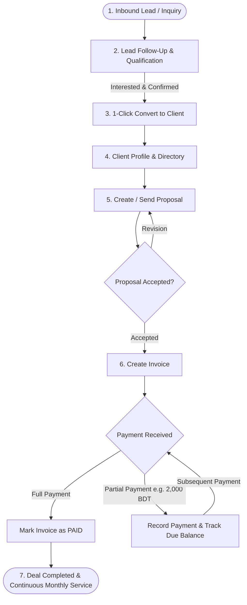

# 🚀 Upskill CRM - Master System Architecture & Implementation Plan

> **Single-Company Dedicated CRM with Granular RBAC, 3-Tier Hierarchy & Streamlined Billing**  
> **Frontend Stack:** React 19, Vite, TypeScript, Redux Toolkit, Tailwind CSS, Lucide Icons, Recharts  
> **Backend Stack (Phase 2 Target):** NestJS, TypeScript, Prisma ORM, PostgreSQL, Redis, Docker  
> **Architecture Focus:** Single-Company Dedicated Architecture, 3-Tier Hierarchy (Super Admin → Admin → Staff), Granular RBAC, HR & Staff Operations (Leaves & Timesheets), Simple & Powerful Invoicing with Partial/Monthly Payment Tracking, Dynamic Permission-Based Dashboards, Future E-Commerce Store Integration.

---

## 📑 Table of Contents
1. [User Roles & Authority Hierarchy (Super Admin vs Admin vs Staff)](#1-user-roles--authority-hierarchy-super-admin-vs-admin-vs-staff)
2. [Granular Role + Permission Engine (RBAC)](#2-granular-role--permission-engine-rbac)
3. [Streamlined Invoicing & Monthly/Partial Payment Model](#3-streamlined-invoicing--monthlypartial-payment-model)
4. [Main CRM Lifecycle Flow](#4-main-crm-lifecycle-flow)
5. [HR & Workforce Operations (Replaced Legacy Technician Scope)](#5-hr--workforce-operations-replaced-legacy-technician-scope)
6. [Executive & Staff Permission-Based Dashboard](#6-executive--staff-permission-based-dashboard)
7. [System Architecture (React Frontend + NestJS Backend)](#7-system-architecture-react-frontend--nestjs-backend)
8. [Current Implementation Status & Audit](#8-current-implementation-status--audit)
9. [Phase 1: Frontend Implementation Checklist](#9-phase-1-frontend-implementation-checklist)
10. [Phase 2: Step-by-Step NestJS Backend Roadmap](#10-phase-2-step-by-step-nestjs-backend-roadmap)

---

## 👥 1. User Roles & Authority Hierarchy (Super Admin vs Admin vs Staff)

The platform is a **single-organization dedicated business system** designed specifically for a **GPS Tracker Selling, Subscription & Fleet Service Company**. There is **no multi-tenant data isolation** — all operational data belongs to the parent enterprise.

All users belong to the company across a strict 3-tier hierarchy:

```
┌────────────────────────────────────────────────────────────────────────┐
│               1. SUPER ADMIN (Business Owner / Root Master)            │
│  - Full root platform access across all modules & settings             │
│  - Exclusive authority to create, edit, activate & deactivate ADMINS   │
│  - Route: /admin/admins                                                │
└───────────────────────────────────┬────────────────────────────────────┘
                                    │ Creates & manages Admins
                                    ▼
┌────────────────────────────────────────────────────────────────────────┐
│             2. ADMIN (Operations Director / General Manager)           │
│  - Complete operational control (Leads, Clients, Sales, HR, Reports)   │
│  - Creates, edits, and manages STAFF members                           │
│  - Controls Staff permissions: Enables or disables modules per staff   │
│  - Route: /admin/team/members                                          │
└───────────────────────────────────┬────────────────────────────────────┘
                                    │ Enables/disables module permissions
                                    ▼
┌────────────────────────────────────────────────────────────────────────┐
│                      3. STAFF (Sales, Billing & HR Team)               │
│  - Restricted STRICTLY to modules explicitly enabled by Admin          │
│  - Unauthorized modules are completely HIDDEN from sidebar navigation  │
│  - Direct URL access blocked by RBAC Route Guard Shield                │
│  - Dashboard automatically adapts to show only authorized metrics      │
└────────────────────────────────────────────────────────────────────────┘
```

### Hierarchy & Scope Matrix

| Role | Scope | Key Capabilities & Boundaries |
|---|---|---|
| **👑 Super Admin** | Ultimate Root Master (Business Owner) | • Unrestricted access to all CRM data, financial ledgers, and reports.<br>• **Exclusive Power**: Only Super Admin can create, modify, or deactivate **Admins** (`/admin/admins`).<br>• Configures company profile, tax rules, backup settings, and payment gateway keys.<br>• Cannot be deleted or demoted by any Admin. |
| **🛡️ Admin** | Operations Director / General Manager | • Manages day-to-day business operations across sales, inventory, team, and billing.<br>• **Staff Management**: Hires, creates, and manages **Staff** accounts (`/admin/team/members`).<br>• **Permission Delegation**: Checks/unchecks module access per staff member (e.g. enable Leads & Proposals, disable Invoices & Reports).<br>• *Admins cannot see, edit, or access `/admin/admins`.* |
| **💼 Staff** | Operational Execution (Sales, Billing, HR) | • Strictly limited to the modules and actions enabled by Admin.<br>• **Zero Unauthorized Visibility**: If an Admin disables `Invoices` or `Reports`, those items do not appear in the sidebar menu and direct URL access redirects with an Access Denied shield.<br>• Executes assigned tasks: sales follow-up, client conversion, creating proposals/invoices, managing employee leaves/timesheets, and recording customer payments. |

---

## 🔐 2. Granular Role + Permission Engine (RBAC)

Rather than rigid hardcoded checks, the system utilizes a **Role + Dynamic Permission Matrix** powered by Redux (`authSlice`) and the `usePermissions` hook.

### Module Permission Keys
- `leads`: Leads pipeline, qualification, and 1-click client conversion
- `customers`: Client directory and client contact persons
- `proposals`: Quotation builder and status tracking
- `sales`: Invoices, line items, and payment receipts
- `subscriptions`: Monthly recurring GPS tracking software subscriptions
- `payments`: Transaction ledger and payment history
- `items`: GPS hardware models, sensors, and accessories catalog
- `team`: HR staff directory, leaves management, and daily timesheets
- `tasks`: Support tasks and project assignments
- `support`: Customer tickets and device warranty tracking
- `reports`: Financial, sales, and subscription analytics
- `settings`: Company profile and system settings
- `admins`: Super Admin exclusive provisioning of Admins

### Granular Matrix Example

| Feature / Module | Staff (Sales) | Staff (Billing) | Staff (HR) | Admin / Super Admin |
|---|:---:|:---:|:---:|:---:|
| **Leads & Pipeline** | ✅ Full Access | ❌ Hidden | ❌ Hidden | ✅ Full Access |
| **Clients & Users** | ✅ Full Access | ✅ Read Only | ❌ Hidden | ✅ Full Access |
| **Proposals & Quotes** | ✅ Full Access | ❌ Hidden | ❌ Hidden | ✅ Full Access |
| **Invoices & Billing** | ❌ Hidden | ✅ Full Access | ❌ Hidden | ✅ Full Access |
| **Subscriptions** | ❌ Hidden | ✅ Full Access | ❌ Hidden | ✅ Full Access |
| **Payments Ledger** | ❌ Hidden | ✅ Full Access | ❌ Hidden | ✅ Full Access |
| **HR Team & Leaves** | ❌ Hidden | ❌ Hidden | ✅ Full Access | ✅ Full Access |
| **Timesheets & Logs** | ❌ Hidden | ❌ Hidden | ✅ Full Access | ✅ Full Access |
| **Admin Management** | ❌ Hidden | ❌ Hidden | ❌ Hidden | 👑 Super Admin Only |

---

## 💳 3. Streamlined Invoicing & Monthly/Partial Payment Model

No complicated multi-stage delivery milestone mechanics are required. Instead, the business runs on a clean, flexible **Invoicing & Payment Engine**:

```
┌────────────────────────────────────────────────────────────────────────┐
│                        CORE INVOICE STRUCTURE                          │
├────────────────────────────────────────────────────────────────────────┤
│ • Invoice Number: INV-2026-XXXX                                        │
│ • Client: Name, Phone, Vehicle/Company Details                         │
│ • Line Items: GPS Tracker Unit, Accessories, Installation, SIM Service │
│ • Total Amount (e.g. 6,000 BDT)                                        │
│ • Paid Amount (e.g. 2,000 BDT)                                         │
│ • Due Balance (e.g. 4,000 BDT)                                         │
│ • Status Pills: [Paid] | [Partially Paid] | [Unpaid] | [Overdue]       │
└───────────────────────────────────┬────────────────────────────────────┘
                                    │
            ┌───────────────────────┴───────────────────────┐
            ▼                                               ▼
┌──────────────────────────────────────┐ ┌──────────────────────────────────────┐
│  ONE-TIME OR PARTIAL PAYMENTS        │ │  MONTHLY RECURRING BILLING           │
├──────────────────────────────────────┤ ├──────────────────────────────────────┤
│ • Customer pays in full or partial   │ │ • Recurring monthly fee (e.g. 2,000  │
│   amounts (e.g. pays 2,000 BDT now,  │ │   BDT/mo or 350 BDT tracking charge) │
│   pays remaining 4,000 BDT later)    │ │ • Auto-generated invoice each month  │
│ • Payment history ledger per invoice │ │ • Payment via bKash / Card / Cash    │
│ • Real-time update of Due Balance    │ │ • Status: Active vs Overdue          │
└──────────────────────────────────────┘ └──────────────────────────────────────┘
```

### Key Advantages:
- **No Complex Installment Overhead**: A single, clean Invoice handles both full payments and partial payments (e.g., paying 2,000 BDT at a time).
- **Payment History Ledger**: Each invoice tracks a list of recorded payments (Date, Amount, Method: Cash/bKash/Bank, Note).
- **Monthly Service Invoices**: For clients paying monthly recurring fees (e.g., 2,000 BDT/month for tracking/monitoring), monthly invoices can be generated automatically or on-demand.

---

## 🔄 4. Main CRM Lifecycle Flow



---

## 👥 5. HR & Workforce Operations (Replaced Legacy Technician Scope)

The legacy technician scope has been completely modernized into a dedicated **HR & Workforce Management Module** under `/admin/team`:

1. **Staff Directory (`/admin/team/members`)**:
   - Management of all internal staff members.
   - Admin manages dynamic module permissions via modal checklist.
   - Status toggles (Active / Inactive), designation, department, contact info.
2. **Leave Management (`/admin/team/leaves`)**:
   - Leave applications (Annual, Sick, Casual, Emergency).
   - Approval workflow: Admin / HR can Approve or Reject requests.
   - Real-time leave balance tracking per employee.
3. **Timesheets & Attendance (`/admin/team/timesheets`)**:
   - Daily employee work hours and clock-in/clock-out tracking.
   - Overtime tracking and task association.

---

## 📊 6. Executive & Staff Permission-Based Dashboard

The Dashboard (`/admin/dashboard` in `src/pages/Dashboard/Overview/Overview.tsx`) dynamically adapts its layout and data streams based on the logged-in user's RBAC permissions:

| Logged-in User | Top KPI Cards | Analytics Row (Row 2) | Recent Activity Row (Row 3) |
|---|---|---|---|
| **💼 Staff (Sales)**<br>*(Permissions: `leads: true`, `sales: false`)* | **Sales Pipeline KPIs**: Total Leads, Active Demos, Proposals Sent, Closed Won Deals | **Leads Funnel Donut Chart** expands to **full-width** (`lg:col-span-12`). | **Recent Leads Pipeline** expands to **full-width** (`lg:col-span-12`). |
| **💳 Staff (Billing)**<br>*(Permissions: `sales: true`, `leads: false`)* | **Financial KPIs**: Payments Today, Payments Month, Invoices Due, Invoices Overdue | **Income vs. Expenses Chart** expands to **full-width** (`lg:col-span-12`). | **Recent Invoices Table** expands to **full-width** (`lg:col-span-12`). |
| **👥 Staff (HR)**<br>*(Permissions: `team: true`, `sales: false`, `leads: false`)* | **HR Operations KPIs**: Total Staff (12), On Leave Today (1), Attendance (91.6%), Pending Approvals (2) | **HR Operations Summary Panel**: Today's attendance distribution & leave requests. | Hidden automatically (sales & billing data restricted). |
| **👑 Super Admin & 🛡️ Admin** | Complete Financial Suite (`Tk`) | **Executive Dual View**: Income vs Expenses (`lg:col-span-8`) + Leads Funnel (`lg:col-span-4`) | **Dual Stream**: Recent Invoices (`lg:col-span-7`) + Recent Leads (`lg:col-span-5`) |

### Dashboard Polish & Cleanliness:
- Garbage demo text and irrelevant icons completely removed from the header.
- Clean header with clear "Dashboard" title and responsive period/sales filters.
- Real-time filter toolbar (Stage, Sales Rep, Source) with 1-click filter reset.

---

## 🏛️ 7. System Architecture (React Frontend + NestJS Backend)

### Frontend Architecture
- **Directory Layout**: Clean top-level feature structure in `src/pages/` (Admins, Team, Leads, Customers, Sales, Proposals, Contracts, Projects, Tasks, Support, Reports, Settings, Auth, UserDashboard).
- **State Management**: Redux Toolkit (`authSlice`, demo role switcher presets, live permission updater).
- **Navigation & RBAC**: Dynamic sidebar filtering via `usePermissions` and route protection in `AdminRoutes.tsx`.

### Backend Architecture (Target for Phase 2)
- **Framework**: NestJS (TypeScript, modular clean architecture).
- **Database**: PostgreSQL managed via Prisma ORM.
- **Authentication**: JWT with refresh tokens, bcrypt password hashing.
- **Guards & RBAC**: Custom `@RequirePermissions()` and `@Roles()` guards.

---

## 🔍 8. Current Implementation Status & Audit

### ✅ Phase 1 Completed Deliverables
- [x] Dedicated 3-tier hierarchy (Super Admin, Admin, Staff).
- [x] Super Admin exclusive Admin provisioning screen (`/admin/admins`).
- [x] HR Module fully implemented under `/admin/team` (Staff Members, Leaves, Timesheets).
- [x] Granular RBAC permission checklist modal in Staff Directory (`/admin/team/members`).
- [x] Dynamic permission-aware Sidebar navigation (unauthorized modules completely hidden).
- [x] Route Guards preventing direct URL access to restricted features.
- [x] Leads Pipeline with 6 stages, drag-and-drop / stage switcher, and Convert to Client modal.
- [x] Customer Directory & Client Users directory with linked fleet details.
- [x] Dynamic Dashboard with permission-based adaptive views for Sales, Billing, HR, and Admin.
- [x] Real-time Dashboard filters (Sales Rep, Stage, Source) with live recalculation of KPIs, charts, and tables.
- [x] Type checking (`npx tsc --noEmit`) and production bundling (`npm run build`) passing with zero errors.

---

## 🛠️ 9. Phase 1: Frontend Implementation Checklist

| Step | Milestone & Module | Description | Status |
|:---:|---|---|:---:|
| **01** | Redux Store & Auth Slice | JWT storage, user metadata, and granular permissions structure | ✅ Completed |
| **02** | Authentication Screens | Login, Forgot Password, and session restoration | ✅ Completed |
| **03** | Core Design System Primitives | Buttons, inputs, modals, dynamic tables, datepickers | ✅ Completed |
| **04** | Global Theme & Responsive Tokens | Dark navy sidebar styling, responsive cards, typography | ✅ Completed |
| **05** | Master Layout Shell | Header, collapsible sidebar, search trigger, breadcrumbs | ✅ Completed |
| **06** | Granular RBAC Guard Hook | Custom hook `usePermissions()` and route protection | ✅ Completed |
| **07** | Dynamic Permission Sidebar | Automatically hide unauthorized module menus for Staff | ✅ Completed |
| **08** | Super Admin Management View | Exclusive screen for Super Admin to create & manage Admins (`/admin/admins`) | ✅ Completed |
| **09** | Staff Management Directory | Staff table with status toggles, avatar, and department tags (`/admin/team/members`) | ✅ Completed |
| **10** | Staff Permission Matrix Modal | Interactive modal for Admin to check/uncheck module permissions | ✅ Completed |
| **11** | HR: Leaves Management | Application, approvals, and balance tracking (`/admin/team/leaves`) | ✅ Completed |
| **12** | HR: Timesheets & Attendance | Daily logs, work hours, overtime (`/admin/team/timesheets`) | ✅ Completed |
| **13** | Leads: Pipeline & Kanban | Stage switcher, source filters, and priority tags (`/admin/leads`) | ✅ Completed |
| **14** | Leads: 1-Click Client Conversion | Modal converting qualified leads into client records | ✅ Completed |
| **15** | Customers: Clients Directory | Client company directory with vehicle & GPS fleet counts (`/admin/customers/clients`) | ✅ Completed |
| **16** | Customers: Client Users | Authorized contact persons & portal login credentials (`/admin/customers/users`) | ✅ Completed |
| **17** | Dashboard: Real-time Filters | Sales Rep, Lead Stage, and Source filter toolbar with active pill banner | ✅ Completed |
| **18** | Dashboard: RBAC Staff Views | Adaptive layouts for Sales (Leads only), Billing (Finance only), HR, Admin | ✅ Completed |
| **19** | Proposals & Quotes Module | Unified quotation builder with 1-click invoice conversion (`/admin/proposals`) | ✅ Completed |
| **20** | Sales: Invoices & Billing Engine | Fully implemented line-item invoice builder, partial payments (e.g. 2,000 BDT), balance due recalculation & printable preview (`/admin/sales/invoices`) | ✅ Completed |
| **21** | Sales: Monthly Subscriptions | Recurring GPS monthly software tracking subscriptions, MRR stats, fleet renewals & billing (`/admin/sales/subscriptions`) | ✅ Completed |
| **22** | Sales: Payments Ledger | Payment receipts transaction ledger, bKash/Bank/Cash channels, and printable receipt (`/admin/sales/payments`) | ✅ Completed |
| **23** | Sales: Expenses Management | Business expenditure logs for SIM data packages, hardware procurement, and field conveyance (`/admin/sales/expenses`) | ✅ Completed |
| **24** | Customer Portal View | Customer self-service vehicle & invoice portal with live GPS status (`/user/overview`) | ✅ Completed |
| **25** | Field Installation & Maintenance Tasks | Technician dispatch for GPS wiring, fuel sensor calibration, SIM swap (`/admin/tasks`) | ✅ Completed |
| **26** | Customer Support & Device RMA | Tickets, device offline alarms, remote relay troubleshooting (`/admin/support/tickets`) | ✅ Completed |
| **27** | Service Contracts & Fleet AMCs | Annual maintenance contracts, SLA tracking, and renewal alerts (`/admin/contracts`) | ✅ Completed |
| **28** | Fleet Deployment Projects | Enterprise fleet onboarding rollouts, multi-vehicle progress tracking (`/admin/projects`) | ✅ Completed |
| **29** | Executive Reports & Analytics | Financial trajectory charts, MRR growth, hardware model sales, CSV export (`/admin/reports`) | ✅ Completed |
| **30** | System & Telematics Settings | Brand profile, bKash & Bank credentials, GPS server ping rates, billing defaults (`/admin/settings`) | ✅ Completed |
| **31** | Production Build Verification | Zero TypeScript and bundling errors across all modules | ✅ Completed |

---

## ⚙️ 10. Phase 2: Step-by-Step NestJS Backend Roadmap

For complete schema models, REST API specifications, DTOs, and controller implementations, refer to the dedicated backend guide:
👉 **[`BACKEND_IMPLEMENTATION_GUIDE.md`](file:///c:/All%20Project/upskill_crm/BACKEND_IMPLEMENTATION_GUIDE.md)**

| Phase | Milestone | Focus Areas |
|:---:|---|---|
| **Step 01-05** | Core Foundation & Auth | NestJS setup, Prisma PostgreSQL schema, JWT auth, Refresh tokens, Password hashing |
| **Step 06-08** | RBAC & Admin Provisioning | RolesGuard, PermissionsGuard, Super Admin `/api/admins`, Staff management `/api/team/members` |
| **Step 09-12** | HR & Workforce APIs | Leaves submission/approval `/api/team/leaves`, Timesheets `/api/team/timesheets` |
| **Step 13-16** | Leads & Client Conversion | Lead CRUD `/api/leads`, Transactional 1-click conversion to Client, Client Users |
| **Step 17-21** | Billing & Invoicing Engine | Invoices `/api/invoices`, Partial payments & due balance recalculation, Recurring subscriptions |
| **Step 22-25** | Analytics & Dashboard APIs | Aggregated KPI endpoints `/api/dashboard/stats`, Filterable metrics by sales rep/date |
| **Step 26-30** | Hardening & Production | Helmet, CORS, Rate limiting, Swagger docs, Docker containerization |

---

*This document is maintained as the single source of truth for the Upskill CRM architecture.*
